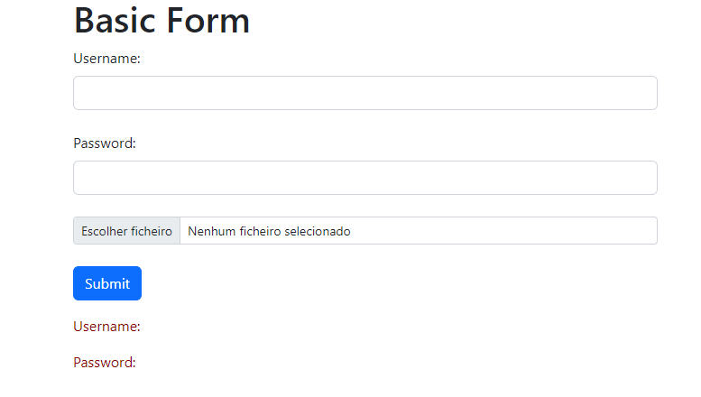
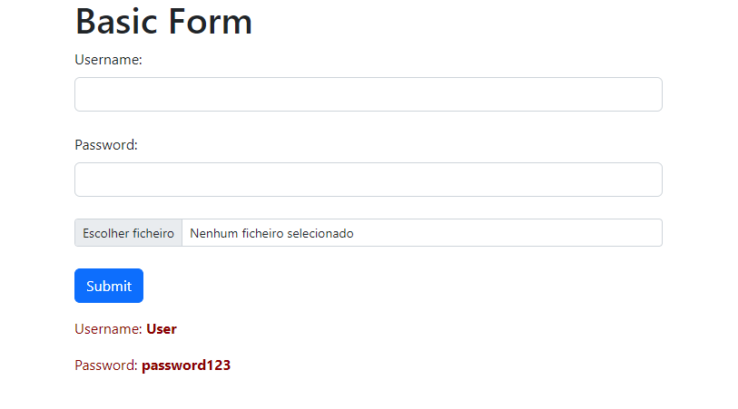

# HTML Data Form  with FastApi
> This project aims to understand the functioning of an html
> form within FastAPI, both obtaining data and the return response to HTML.
## Table of Contents
* [Technologies Used](#technologies-used)
* [Screenshots](#screenshots)
* [Setup](#setup)
* [Contact](#contact)

## Technologies Used

## Screenshots
* Unfilled values

* Filled values

<!-- If you have screenshots you'd like to share, include them here. -->

## Setup

## Contact
Created by [Marc](https://www.linkedin.com/in/marciano-pazinatto-86a1741b4/) - Feel free to contact me!
